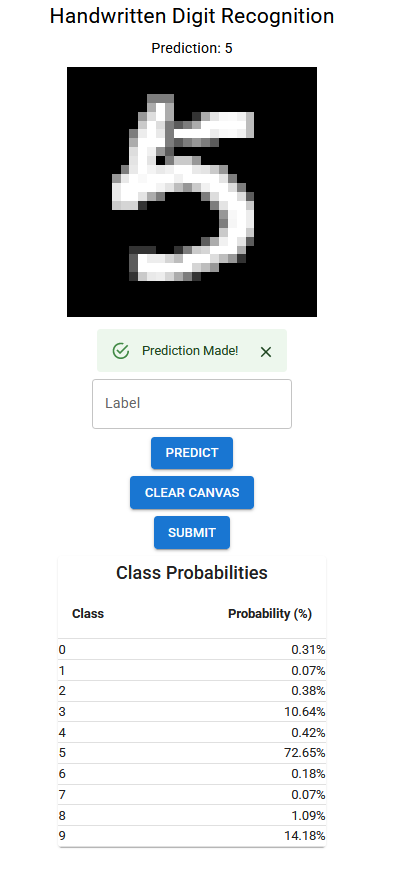
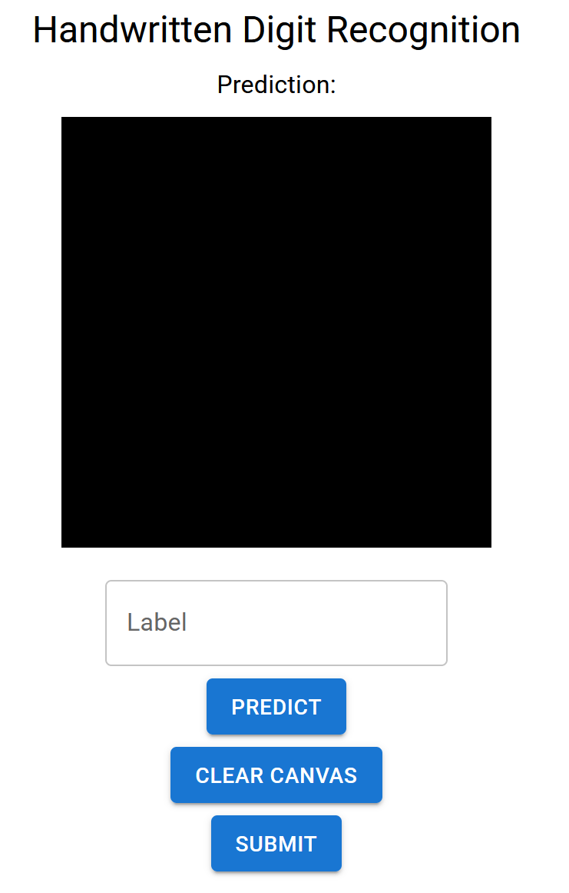

# Real-Time MNST Writting and Recognition Website

## Sample Image:

<div align="center">
  
</div>

## How to set up:

Run the React Front End (require installation of npm):

```
git clone https://github.com/PiggyBotanist/project_digit_recognition.git
cd project_digit_recognition/frontend
npm run dev
```

Run the Django Back End Together:

```
cd project_digit_recognition
python manage.py runserver
```

If both run successfully without any error, then simply go to your [local address](http://127.0.0.1:8000/) and you should be able to see this screen:

<div align="center">
  
</div>

Inside the black box you can write by holding your mouse with left click around. After you are done drawing your number you can see if the neural network predict it accurately.

If you like your hand writing you can also add a correct label and press submit to store it in the Django sqlite database (create your own dataset).

HAVE FUN !!

## Concepts

The Front end is rendered using **REACT.js** with **webpack**. The backend and the database are build using **Django**, and the machine learning model is trained on the publicaly available **MNST hand written digits** dataset. If you are interested in seeing the code you can find them here:

Pytorch Code:

```
Model:                  project_digit_recognition/classifier/pytorch_model/model.py
Training:               project_digit_recognition/classifier/pytorch_model/train.py
Weight Loader:          project_digit_recognition/classifier/pytorch_model/load.py

Pretrained Weights      project_digit_recognition/classifier/pytorch_model/weights
-  0.76_MNST_digit_classifier.pt: alpha = 0.01, batch size = 32, epochs = 5 (Accuracy ~= 76 %)
-  0.99_MNST_digit_classifier.pt: alpha = 0.01, batch size = 64, epochs = 10 (Accuracy ~= 99 %)

The default selected pretrain model is the 99% one
```

React Code:

```
project_digit_recognition/frontend/react/components
```

Django View Function:

```
project_digit_recognition/classifier/views.py
```
